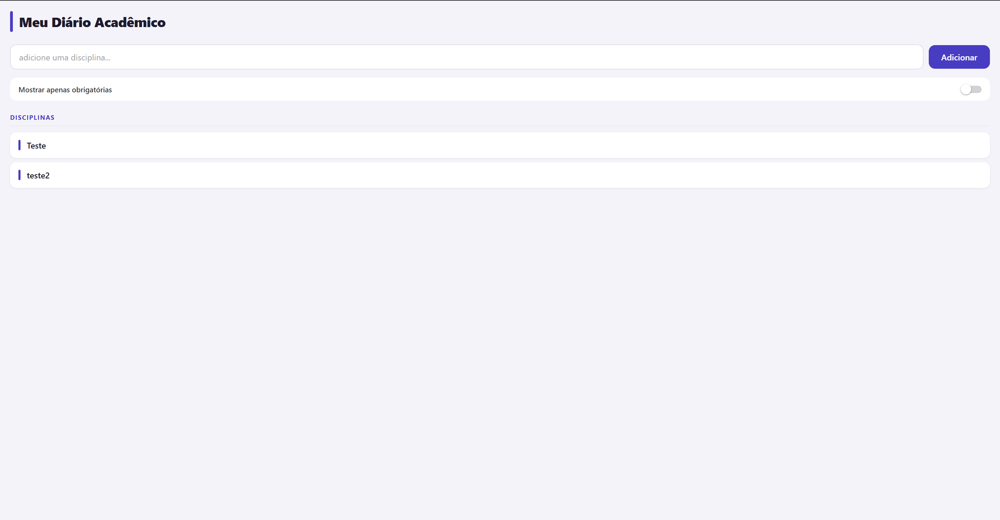

# Meu Diário Acadêmico

Aplicativo mobile feito com **React Native (Expo)** para cadastrar e organizar as disciplinas do semestre. Atividade da disciplina de Programação para Dispositivos Móveis (curso ADS).

## Print da tela



A tela mostra:
- Cabeçalho com o título do app
- Campo de texto para cadastrar uma nova disciplina + botão "Adicionar"
- Switch "Mostrar apenas obrigatórias" (ainda sem lógica de filtro)
- Lista de disciplinas cadastradas, com estado vazio ilustrado

## Comando usado para criar o projeto

```bash
npx create-expo-app meudiarioacademico
```

Depois, entrei na pasta gerada e instalei a dependência de safe area:

```bash
cd meudiarioacademico
npx expo install react-native-safe-area-context
```

## Como rodar

```bash
npm install
npx expo start
```

Abra o app no celular pelo **Expo Go** escaneando o QR code exibido no terminal, ou rode num emulador Android/iOS.

## Stack

- [Expo](https://expo.dev) SDK 57
- React Native 0.86
- `react-native-safe-area-context` para respeitar a área segura da tela (notch, status bar)

## Estrutura do projeto

```
├── App.js                 # ponto de entrada, monta Header + Main
├── labels.js               # constantes de texto (título, placeholder, etc.)
├── components/
│   ├── Header.jsx           # cabeçalho com título e subtítulo do app
│   ├── Input.jsx             # campo de texto para nova disciplina
│   ├── Button.jsx            # botão "Adicionar" (Pressable com estado de pressionado)
│   ├── Main.jsx               # estado da lista, formulário e regras de layout
│   └── Materia.jsx             # item individual da lista de disciplinas
└── docs/
    └── screenshot-app.png       # print usado neste README
```
